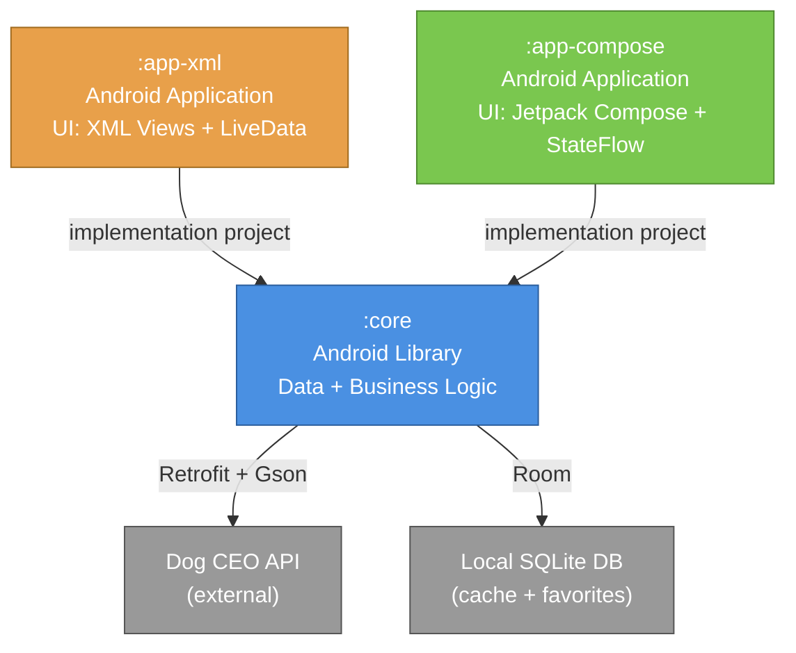

# CatsNDogs (MIP-3: Multi-Module Architecture)

Bem-vindo à fase MIP-3 do projeto CatsNDogs!
Esta aplicação foi inicialmente desenvolvida no MIP-2 como um módulo único com UI em XML, focando-se em arquitetura MVVM, persistência offline com Room e integração com a Dog CEO API.

Nesta fase (MIP-3), a aplicação foi refatorada para uma arquitetura multi-módulo, dividindo responsabilidades e suportando simultaneamente duas versões executáveis da aplicação: uma baseada em Views clássicas (XML) e outra desenvolvida de raiz em Jetpack Compose.

## 🏗 Arquitetura Multi-Módulo



## 🚀 Como correr cada App

O projeto dispõe de duas versões executáveis que partilham a mesma camada de dados (`:core`), incluindo a mesma base de dados local para cache e favoritos.

**Para compilar e instalar a versão clássica (XML Views):**
```bash
./gradlew :app-xml:installDebug
```

**Para compilar e instalar a versão moderna (Jetpack Compose):**
```bash
./gradlew :app-compose:installDebug
```

*(Nota: Podes usar as run configurations do Android Studio para executar qualquer um dos módulos diretamente).*

## 🛠 Stack Técnico

- **Linguagem:** Kotlin
- **Build System:** Gradle (Kotlin DSL, Version Catalog) / AGP 9.x
- **Arquitetura:** MVVM, Repository Pattern, Multi-Module
- **Core Layer:** Retrofit (Networking), Room Database (Persistência)
- **UI (app-xml):** XML Layouts, LiveData, Glide (Imagens)
- **UI (app-compose):** Jetpack Compose, Material 3, Navigation Compose, StateFlow, Coil (Imagens)

## 📚 Documentação

Para consultar a documentação detalhada de planeamento, arquitetura e registo de evolução desta fase, acede a:
👉 [**Documentação MIP-3**](docs/MIP3/)
