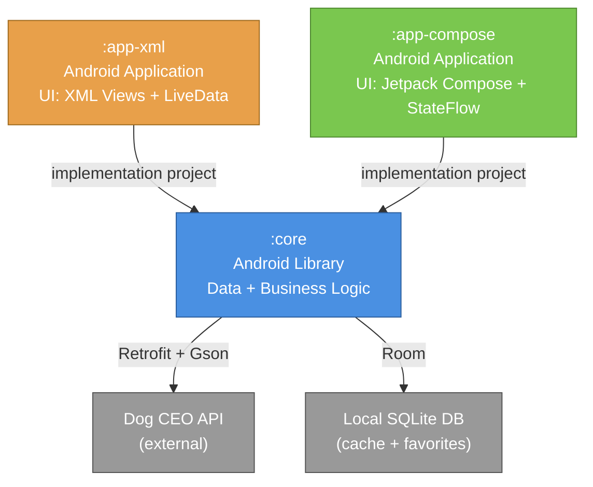

# 00 — Module Diagram

Diagrama de dependências entre os três módulos do projeto MIP-3.

## Diagrama

## Princípios

1. **Dependência unidirecional:** `:app-xml` e `:app-compose` dependem de `:core`. `:core` **não conhece nenhum dos dois**.
2. **Sem dependência cruzada:** `:app-xml` não conhece `:app-compose`, e vice-versa.
3. **Source of truth única:** modelos de domínio, API client, repository e Room database vivem **só** em `:core`.
4. **UI-specific stays in UI module:** Activities, Composables, Adapters, ViewModels, e qualquer state holder específico da apresentação ficam no respetivo módulo de app.

## Justificação

Esta estrutura cumpre os três objetivos do MIP-3:

- **Reutilização:** `:core` é construído uma vez e consumido por duas UIs distintas.
- **Separação de responsabilidades:** o tipo de UI (imperativa vs declarativa) não contamina a lógica de negócio.
- **Comparabilidade:** ambas as apps fazem exatamente as mesmas operações de dados, o que torna a comparação UI-vs-UI honesta — a única variável é o paradigma de UI.

## Nota sobre ViewModels

Os ViewModels **não** vivem em `:core` porque o seu state shape difere entre as duas UIs:

- `:app-xml` usa `LiveData<UiState<T>>` (compatível com `Observer` pattern do XML).
- `:app-compose` usa `StateFlow<UiState<T>>` (compatível com `collectAsStateWithLifecycle()`).

O `Repository` no `:core` expõe `Flow<...>` quando aplicável — cada ViewModel adapta para o tipo que prefere via `.asLiveData()` ou `.stateIn(...)`.
